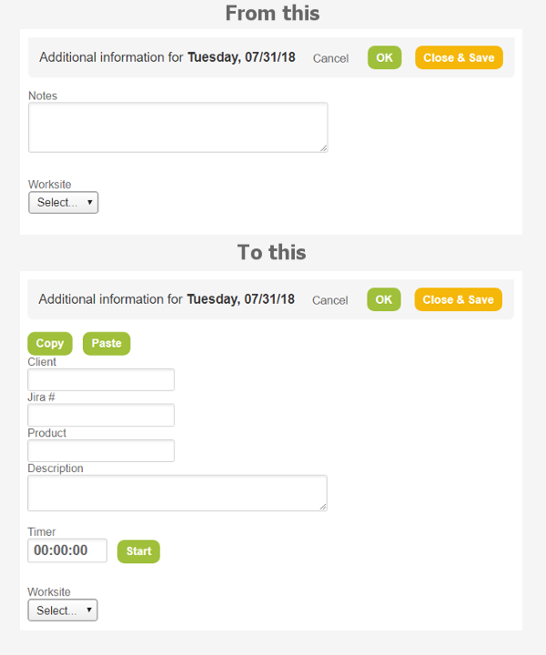

# Openair Extension
A Google Chrome extension that provides a timer and some customizations to Netsuite Openair Timesheets

## Getting Started

I started the development of this extension as a way to help with the Openair notes filling based on the rules adopted by the company I work for.

In this company, for every timekeeping, we are expected to follow the standard below:

[Name of the client] / [Jira ticket number] / [Name of the product] - [Description]
