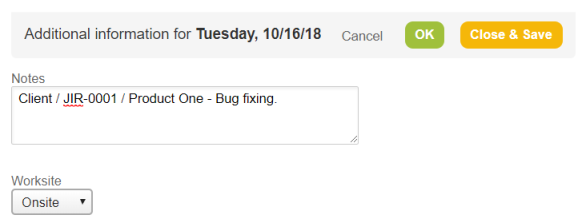
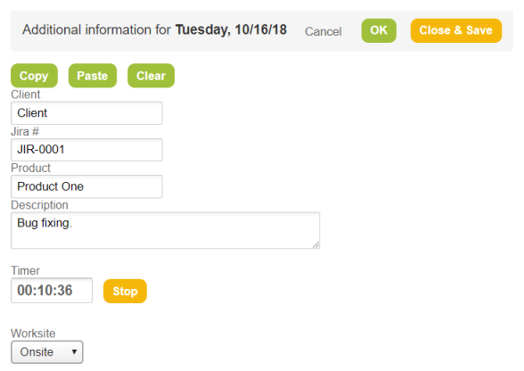

# Openair Extension


> A [Chrome](https://www.google.com/chrome/browser) extension that provides a timer and some customizations to [Netsuite Openair](www.openair.com) timesheets.

## Introduction

In one of my jobs we had a very specific rule to fill out our timesheets. All of the employees should follow this template:

```
[Client's name] / [Issue ID] / [Product's name] - [Brief description]
```



This was not ideal for obvious reasons:
- chances of confusion in the order of the information;
- counter-intuitive for new employees.

Then I decided to create an extension to tackle these drawbacks and transform the previous dialog into this:



## Getting started

To install the extension:

1. Download ZIP (`Clone or download` button)
2. Unzip to your destination path
3. Go to **chrome://extensions/** and enable **Developer mode** 
4. Click the **Load unpacked extension** button and select the destination path

For now on, whenever you access the Openair timesheet page, it will be automatically enabled.
